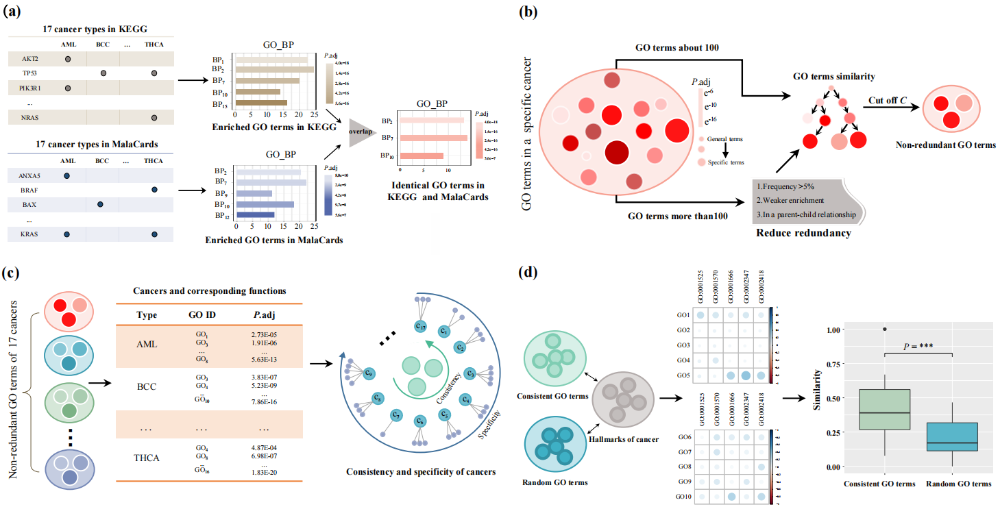

# [GO4Cancer (A standard GO terms for cancers)](https://github.com/zpliulab/GO4Cancer)

In this work, an **GO4Cancer** for revealing function changes from rewiring regulations by network ontology analysis was proposed. 

## GO4Cancer
<!--START_SECTION:news-->
* **GO4Cancer**: A **GO4Cancer** fremework is proposed to evaluate the results of rewiring networks which is more similar to phenotype. 
* If you have any questions about **GO4Cancer**, please directly contact the corresponding author [Prof. Zhi-Ping Liu](https://scholar.google.com/citations?user=zkBXb_kAAAAJ&hl=zh-CN&oi=ao) with the E-mail: zpliu@sdu.edu.cn
<!--END_SECTION:news-->

## Citation
Chang, Yaohua, et al. "**XXX**." Submit to [XXX](https://www.journals.elsevier.com/expert-systems-with-applications).  

## Data
<!--START_SECTION:news-->
* **R** file gives all **R** codes used in this work. 
* **Data** file gives some necessary input/output files by the **R** codes. 
* Here are two examples. Other cancer data can be downloaded from the website.
* Some of these input files only give the first few lines, but this does not affect the results of the work (**GO4Cancer**).
* In the **Supplementary file** file, we present the necessary **Additional files** contained in our work. 
<!--END_SECTION:news-->

## R codes for Data (RforData)
The **serial number (1), (2), ..., (14)** represents the order in which the program runs in our work. 
<!--START_SECTION:news-->
* (1) donut picture.R  --  The number of genes in 17 cancers in KEGG and MalaCards databases is graphically presented.
* (2) GFEA.R  --  Gene functional enrichment analysis. The function of 17 cancers is enriched in this way.
* (3) enrich go seventheen.R  --  The number of functions in 17 cancers in KEGG and MalaCards databases is graphically presented.
* (4) Enriched and Deredun.R  --  Enrichment of cancer functions and deredundancy.
* (5) deredun.R  --  De-redundancy process. Retain more specific GO terms.
* (6) dot plot_Redun.R  --  dot diagram after removing redundancy.
* (7) spe GO 17.R  --  Specific GO terms for 17 cancers are presented.
* (8) SPE_CON.R  --  Specificity and Consistency in 17 cancers.
* (9) Gen_network.R  --  Establish Gene Co-expression Network.
* (10) terms similarity.R  --  Calculate the semantic similarity between GO terms.
* (11) iNOA.R  --  An Improvement of Network Ontology Analysis with GO Semantic Similarity.
* (12) NetGOterms.R  --  The process of network functions.
* (13) CN_NO_net _compa.R  --  Comparison of disease and normal network and phenotype in endometrial cancer.
* (14) Rand 30t.R  --  Take 30 GO terms randomly from all the GO terms and take the mean value.
<!--END_SECTION:news-->

## GO4Cancer (2024), Zhi-Ping Liu all rights reserved
This program package is supported by the copyright owners and coders "as is" and without warranty of any kind, express or implied, including, but not limited to, the implied warranties of merchantability and fitness for a particular purpose. In no event shall the copyright owner or contributor be liable for any direct, indirect, incidental, special, exemplary, or consequential damages (including, without limitation, procurement of substitute goods or services; loss of use, data, or profits; or business interruption), regardless of the theory of liability, whether in contract, strict liability or tort (including negligence or otherwise) for any use of the software, even if advised of the possibility of such damages.
